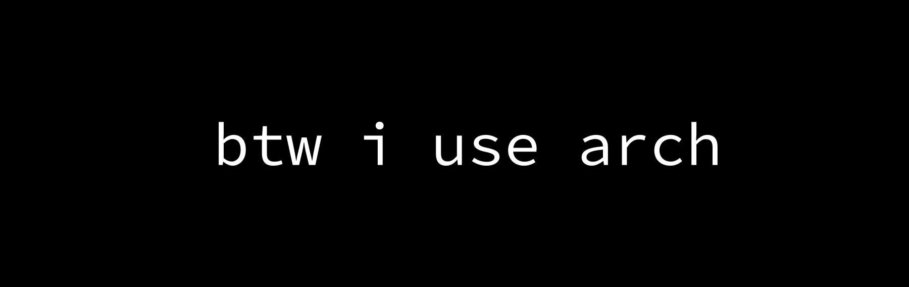

#  Hi there!

I'm Ellie, studying to be a backend developer and trying to become a devops engineer. That's my stack 

And bonus, I know how to work with the web and know a couple of frameforks like django, vite, etc..
