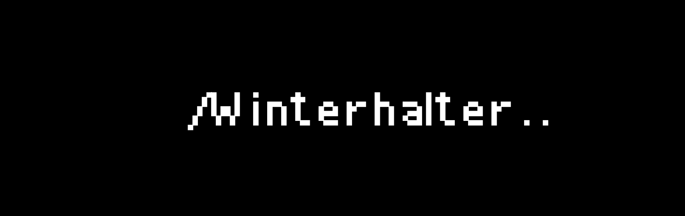

```golang
I'm studying to be a Backend Developer. Also considering working as a Devops engineer.

func My_Stack() {
- Docker
- PostreSQL, MySQL, MongoDB
- JS, Python, Golang
- Bash, PowerShell
- Ubuntu
- NodeJS
- Nginx, Apache
- HTML, CSS, React, Django
}
```
